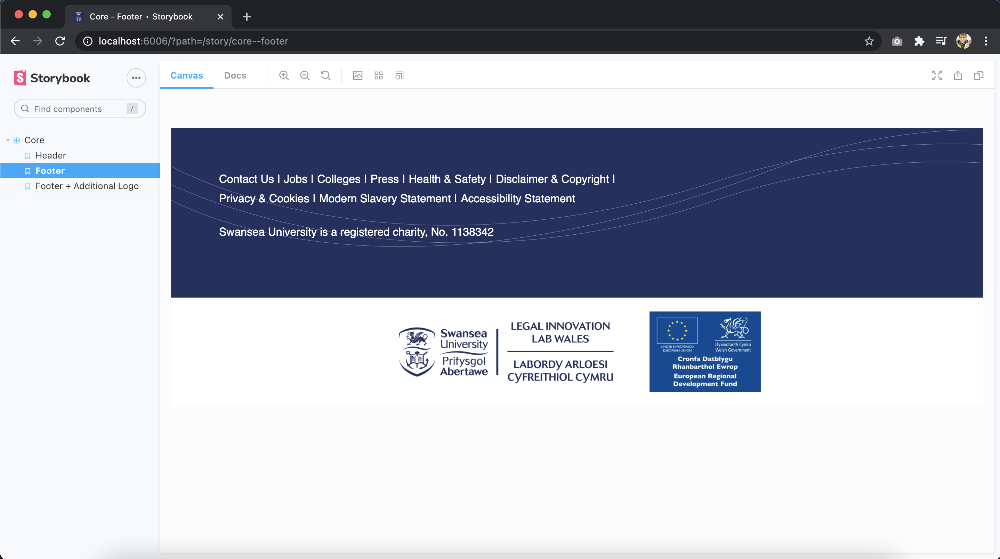

# Legal Innovation Lab Wales - React Components

This project contains a collection of custom reusable React components used by the software development team at 
Legal Innovation Lab Wales.

To run this project you will need to have [node.js](https://nodejs.org/en/) and npm (should come bundled with node) 
installed.

---
### Build

To build the project run ```npm install``` from this directory, this will pull in the project dependencies including
[Storybook](https://storybook.js.org/).

To run Storybook: ```npm run storybook```. This will set up the Storybook at ```http://localhost:6006```, here you
should be able to see our current collection of components as below.



The Storybook is populated by any ```.stories.js``` files in the ```src``` directory, the configuration for
this can be found in ```.storybook/main.js```. Stories can be used to import React components and display them in the 
Storybook UI.

To create a new React component simply add a new ```component_name.js``` file along with ```component_name.scss``` file 
(if custom styles are required) under ```src/components```. Your component JS file should default export the component 
you create and import the SASS file.

```core.stories.js``` includes an import for the [SUDS](https://intranet.swan.ac.uk/suds/) stylesheet, the assumption 
here is that any LILW application that is utilising our React component library will also need to import this stylesheet.

---
### Publish

To publish an updated version of the component library you will need to login to your npm account from the CLI 
(```npm login```) and your account will need to be added as a contributor to the package on npm.

With the above done you can now bump the version number in ```package.json``` and compile the library 
```npm run compile```. With the library compiled you can publish with ```npm publish``` and all package contributors
will be notified of the update.